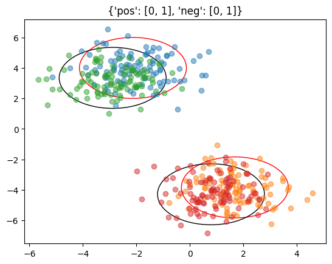

```python
#hide
from LeveragingStructure.core import *
```


```python
import warnings
warnings.filterwarnings('ignore')
```

# Leveraging Structure for Improved Classification of Grouped Data


## Create environment and Install Dependencies

`conda create --name structure python=3.9`

`conda activate structure`

`python -m pip install -r requirements.txt`

# Running Experiment on Synthetic Data

## Create Synthetic Dataset


```python
from LeveragingStructure.data.leveragingStructure import SyntheticSetting2
```


```python
import numpy as np
```


```python
dataset = SyntheticSetting2.from_criteria(n_targets=10,n_clusters=2,dim=2,aucRange=[.75,.95],
                                          irreducibility_range=[.01,.9],
                                         num_points_labeled_partition=lambda: np.round(np.random.normal(1000,100)),
                                         num_points_unlabeled_partition=lambda: np.round(np.random.normal(10000,1000)),
                                         timeoutMins=2,nTimeouts=3)
```

    generating components
    making dg


    100%|██████████████████████████████████████████████████████████████████████████████████████████████████████████████████████████████████████████████████| 2/2 [00:00<00:00, 29.51it/s]


    isMetricSatisfied{'aucpn': 0.5, 'irreducibility': [0.0, 0.0]}
    anchorSetProp0.01
    not satisfied
    current time: 1669922018.2182295 - will time out at 1669922138.2075827
    Mu Perturb
    isMetricSatisfied{'aucpn': 0.76286684, 'irreducibility': [0.05, 0.0422]}
    anchorSetProp0.01
    isMetricSatisfied{'aucpn': 0.5, 'irreducibility': [0.0, 0.0]}
    anchorSetProp0.01
    not satisfied
    current time: 1669922018.2440827 - will time out at 1669922138.2372954
    Perturb Proportion
    isMetricSatisfied{'aucpn': 0.5, 'irreducibility': [0.0, 0.0]}
    anchorSetProp0.01
    not satisfied
    current time: 1669922018.2577627 - will time out at 1669922138.2372954
    Mu Perturb
    isMetricSatisfied{'aucpn': 0.7629520799999999, 'irreducibility': [0.0466, 0.0502]}
    anchorSetProp0.01
    done making dg
    jittering comps
    getting conflicting pairs


    0it [00:00, ?it/s]


    conflicting pairs
    [(0, 1)]
    [(0, 1)]
    checking 0 - 1


    0it [00:00, ?it/s]


    ..... 0 - 1 conflict
    checking 0 - 1


    100it [00:02, 44.85it/s]


    .... no conflict


    100it [00:01, 51.42it/s]


    conflicting pairs
    []
    done jittering comps
    done generating components


      0%|                                                                                                                                                         | 0/10 [00:00<?, ?it/s]
      0%|                                                                                                                                                          | 0/2 [00:00<?, ?it/s]
                                                                                                                                                                                         
      0%|                                                                                                                                                          | 0/2 [00:00<?, ?it/s]
                                                                                                                                                                                         
      0%|                                                                                                                                                          | 0/2 [00:00<?, ?it/s]
                                                                                                                                                                                         
      0%|                                                                                                                                                          | 0/2 [00:00<?, ?it/s]
                                                                                                                                                                                         
      0%|                                                                                                                                                          | 0/2 [00:00<?, ?it/s]
                                                                                                                                                                                         
      0%|                                                                                                                                                          | 0/2 [00:00<?, ?it/s]
                                                                                                                                                                                         
      0%|                                                                                                                                                          | 0/2 [00:00<?, ?it/s]
                                                                                                                                                                                         
      0%|                                                                                                                                                          | 0/2 [00:00<?, ?it/s]
                                                                                                                                                                                         
      0%|                                                                                                                                                          | 0/2 [00:00<?, ?it/s]
                                                                                                                                                                                         
      0%|                                                                                                                                                          | 0/2 [00:00<?, ?it/s]
    100%|███████████████████████████████████████████████████████████████████████████████████████████████████████████████████████████████████████████████| 10/10 [00:00<00:00, 125.48it/s]

    done from components


    


### Visualize (Synthetic Dataset Only)


```python
dataset.NMix.plotCIEllipse()
```





## Split Labeled and Unlabeled Sets


```python
from sklearn.model_selection import GroupShuffleSplit
```

### Split Labeled Train and Validation Sets


```python
XLabeled,yLabeled,instanceNumLabeled,bagLabeled = map(np.concatenate, list(zip(*[s[:]+(s.instanceNum,
                                                                                       np.ones(len(s),
                                                                                               dtype=int)*sNum) \
                                                                                 for (sNum,s) in enumerate(dataset.labeledSamples)])))
gss = GroupShuffleSplit(n_splits=1)

labeledTrainIndices,labeledValIndices = next(iter(gss.split(XLabeled,yLabeled,instanceNumLabeled)))

XLabeledTrain = XLabeled[labeledTrainIndices]
XLabeledVal = XLabeled[labeledValIndices]
yLabeledTrain = yLabeled[labeledTrainIndices]
yLabeledVal = yLabeled[labeledValIndices]
instanceNumLabeledTrain = instanceNumLabeled[labeledTrainIndices]
instanceNumLabeledVal = instanceNumLabeled[labeledValIndices]
bagLabeledTrain = bagLabeled[labeledTrainIndices]
bagLabeledVal = bagLabeled[labeledValIndices]
```

### Split Unlabeled Train and Test Sets


```python
XUnlabeled,yUnlabeled,instanceNumUnlabeled = list(zip(*[s[:]+(s.instanceNum,) for s in dataset.unlabeledSamples]))

bagUnlabeled = [np.ones(len(y),dtype=int)*bagNum for bagNum,y in enumerate(yUnlabeled)]

XUnlabeled,yUnlabeled,bagUnlabeled,instanceNumUnlabeled = map(np.concatenate, [XUnlabeled,yUnlabeled,bagUnlabeled,instanceNumUnlabeled])

unlabeledTrainIndices,unlabeledTestIndices = next(iter(GroupShuffleSplit(n_splits=1).split(XUnlabeled,
                                                                                           yUnlabeled,
                                                                                           instanceNumUnlabeled)))

XUnlabeledTrain,yUnlabeledTrain = XUnlabeled[unlabeledTrainIndices],yUnlabeled[unlabeledTrainIndices]
bagUnlabeledTrain = bagUnlabeled[unlabeledTrainIndices]
instanceNumUnlabeledTrain = instanceNumUnlabeled[unlabeledTrainIndices]

XUnlabeledTest,yUnlabeledTest = XUnlabeled[unlabeledTestIndices],yUnlabeled[unlabeledTestIndices]
bagUnlabeledTest = bagUnlabeled[unlabeledTestIndices]
instanceNumUnlabeledTest = instanceNumUnlabeled[unlabeledTestIndices]
```

## Run Method on Synthetic Data


```python
import os
if not os.path.isdir("experiments"):
    os.mkdir("experiments")
```


```python
from LeveragingStructure.experiment_utils import Method,GroupAwareGlobal,FrustratinglyEasyDomainAdaptation
```

    2022-12-01 14:13:58.846668: I tensorflow/core/platform/cpu_feature_guard.cc:193] This TensorFlow binary is optimized with oneAPI Deep Neural Network Library (oneDNN) to use the following CPU instructions in performance-critical operations:  AVX2 AVX512F AVX512_VNNI FMA
    To enable them in other operations, rebuild TensorFlow with the appropriate compiler flags.
    2022-12-01 14:13:59.074326: I tensorflow/core/util/util.cc:169] oneDNN custom operations are on. You may see slightly different numerical results due to floating-point round-off errors from different computation orders. To turn them off, set the environment variable `TF_ENABLE_ONEDNN_OPTS=0`.
    2022-12-01 14:13:59.122275: E tensorflow/stream_executor/cuda/cuda_blas.cc:2981] Unable to register cuBLAS factory: Attempting to register factory for plugin cuBLAS when one has already been registered
    2022-12-01 14:14:00.099701: W tensorflow/stream_executor/platform/default/dso_loader.cc:64] Could not load dynamic library 'libnvinfer.so.7'; dlerror: libnvinfer.so.7: cannot open shared object file: No such file or directory; LD_LIBRARY_PATH: /usr/local/cuda-11.2/lib64:/usr/local/cuda-11.2/extras/CUPTI/lib64:/usr/local/cuda-10.1/lib64
    2022-12-01 14:14:00.099824: W tensorflow/stream_executor/platform/default/dso_loader.cc:64] Could not load dynamic library 'libnvinfer_plugin.so.7'; dlerror: libnvinfer_plugin.so.7: cannot open shared object file: No such file or directory; LD_LIBRARY_PATH: /usr/local/cuda-11.2/lib64:/usr/local/cuda-11.2/extras/CUPTI/lib64:/usr/local/cuda-10.1/lib64
    2022-12-01 14:14:00.099838: W tensorflow/compiler/tf2tensorrt/utils/py_utils.cc:38] TF-TRT Warning: Cannot dlopen some TensorRT libraries. If you would like to use Nvidia GPU with TensorRT, please make sure the missing libraries mentioned above are installed properly.


```python
if not os.path.isdir("experiments/synthetic_experiment"):
    os.mkdir("experiments/synthetic_experiment")
```


```python
method = Method("experiments/synthetic_experiment/ourMethod")
```


```python
method.fit(XLabeledTrain,yLabeledTrain,XLabeledVal,yLabeledVal,XUnlabeledTrain,bagUnlabeledTrain,
           cluster_range=np.arange(1,4))
```

      0%|                                                                                                                                                          | 0/3 [00:00<?, ?it/s]

    Init 1/3 with method k-means++
    Inertia for init 1/3: 154.88849512732224
    Init 2/3 with method k-means++
    Inertia for init 2/3: 89.42954743102987
    Init 3/3 with method k-means++
    Inertia for init 3/3: 208.9066901129121
    Minibatch step 1/910740: mean batch inertia: 3.210981907852195
    Minibatch step 2/910740: mean batch inertia: 2.3838152386489133, ewa inertia: 2.3838152386489133
    Minibatch step 3/910740: mean batch inertia: 2.019706831759315, ewa inertia: 2.383735280722613
    Converged (small centers change) at step 3/910740


     67%|█████████████████████████████████████████████████████████████████████████████████████████████████▎                                                | 2/3 [00:00<00:00,  2.63it/s]

    Init 1/3 with method k-means++
    Inertia for init 1/3: 54.17210586737201
    Init 2/3 with method k-means++
    Inertia for init 2/3: 63.280464050307806
    Init 3/3 with method k-means++
    Inertia for init 3/3: 54.32203683157893
    Minibatch step 1/910740: mean batch inertia: 3.439023059155776
    Minibatch step 2/910740: mean batch inertia: 3.105032404685986, ewa inertia: 3.105032404685986
    Minibatch step 3/910740: mean batch inertia: 4.868353572549738, ewa inertia: 3.105419628659165
    Minibatch step 4/910740: mean batch inertia: 2.4018526179097255, ewa inertia: 3.1052651258843644
    Minibatch step 5/910740: mean batch inertia: 2.014525095968766, ewa inertia: 3.105025600212135
    Minibatch step 6/910740: mean batch inertia: 1.8673810409924698, ewa inertia: 3.104753814418181
    Converged (small centers change) at step 6/910740


    100%|██████████████████████████████████████████████████████████████████████████████████████████████████████████████████████████████████████████████████| 3/3 [00:01<00:00,  2.05it/s]


    [0, 0.7845087527807915, 0.5042295111913608]
    found 2 clusters...
    Init 1/3 with method k-means++
    Inertia for init 1/3: 132.86010490019095
    Init 2/3 with method k-means++
    Inertia for init 2/3: 215.83435170147774
    Init 3/3 with method k-means++
    Inertia for init 3/3: 169.39269234570384
    Minibatch step 1/910740: mean batch inertia: 2.398997116762969
    Minibatch step 2/910740: mean batch inertia: 2.6962184698804967, ewa inertia: 2.6962184698804967
    Minibatch step 3/910740: mean batch inertia: 2.037702461218548, ewa inertia: 2.6960738602711283
    Minibatch step 4/910740: mean batch inertia: 2.8290552857317555, ewa inertia: 2.69610306288995
    Minibatch step 5/910740: mean batch inertia: 1.505759437456371, ewa inertia: 2.6958416643447
    Converged (small centers change) at step 5/910740


     50%|█████████████████████████████████████████████████████████████████████████                                                                         | 1/2 [00:00<00:00,  1.06it/s]

    Cluster 0 validation auc: 0.760


    100%|██████████████████████████████████████████████████████████████████████████████████████████████████████████████████████████████████████████████████| 2/2 [00:01<00:00,  1.03it/s]

    Cluster 1 validation auc: 0.765


    
    100%|██████████████████████████████████████████████████████████████████████████████████████████████████████████████████████████████████████████████████| 2/2 [00:00<00:00,  4.23it/s]


```python
mm1 = Method("experiments/synthetic_experiment/singleClusterAblation")
```


```python
mm1.fit(XLabeledTrain,yLabeledTrain,XLabeledVal,yLabeledVal,XUnlabeledTrain,bagUnlabeledTrain,
       cluster_range=[1])
```

    100%|███████████████████████████████████████████████████████████████████████████████████████████████████████████████████████████████████████████████| 1/1 [00:00<00:00, 18396.07it/s]


    [0]
    found 1 clusters...
    Init 1/3 with method k-means++
    Inertia for init 1/3: 716.6219857622386
    Init 2/3 with method k-means++
    Inertia for init 2/3: 1719.6664222957543
    Init 3/3 with method k-means++
    Inertia for init 3/3: 647.9113321036131
    Minibatch step 1/910740: mean batch inertia: 13.716638560322755
    Minibatch step 2/910740: mean batch inertia: 13.881091996496428, ewa inertia: 13.881091996496428
    Converged (small centers change) at step 2/910740


    100%|██████████████████████████████████████████████████████████████████████████████████████████████████████████████████████████████████████████████████| 1/1 [00:01<00:00,  1.07s/it]

    Cluster 0 validation auc: 0.800


    
    100%|██████████████████████████████████████████████████████████████████████████████████████████████████████████████████████████████████████████████████| 1/1 [00:00<00:00,  2.90it/s]


```python
ag = GroupAwareGlobal(savepath="experiments/synthetic_experiment/groupAwareGlobal")
```


```python
ag.fit(XLabeledTrain,yLabeledTrain,bagLabeledTrain,
       XLabeledVal,yLabeledVal,bagLabeledVal,
       XUnlabeledTrain,bagUnlabeledTrain,
           cluster_range=np.arange(1,4))
```

    [Parallel(n_jobs=-1)]: Using backend ThreadingBackend with 72 concurrent workers.


    creating matrices
    done
    training


    [Parallel(n_jobs=-1)]: Done  56 tasks      | elapsed:    0.2s
    [Parallel(n_jobs=-1)]: Done 306 tasks      | elapsed:    0.6s
    [Parallel(n_jobs=-1)]: Done 500 out of 500 | elapsed:    0.8s finished
    [Parallel(n_jobs=72)]: Using backend ThreadingBackend with 72 concurrent workers.
    [Parallel(n_jobs=72)]: Done  56 tasks      | elapsed:    0.0s
    [Parallel(n_jobs=72)]: Done 306 tasks      | elapsed:    0.1s
    [Parallel(n_jobs=72)]: Done 500 out of 500 | elapsed:    0.1s finished


```python
fe = FrustratinglyEasyDomainAdaptation(savepath="experiments/synthetic_experiment/frustratinglyEasy")
```


```python
fe.fit(XLabeledTrain,yLabeledTrain,XLabeledVal,yLabeledVal,XUnlabeledTrain,bagUnlabeledTrain,)
```

    [Parallel(n_jobs=-1)]: Using backend ThreadingBackend with 72 concurrent workers.
    [Parallel(n_jobs=-1)]: Done  56 tasks      | elapsed:    0.2s
    [Parallel(n_jobs=-1)]: Done 306 tasks      | elapsed:    0.6s
    [Parallel(n_jobs=-1)]: Done 500 out of 500 | elapsed:    0.8s finished
    [Parallel(n_jobs=72)]: Using backend ThreadingBackend with 72 concurrent workers.
    [Parallel(n_jobs=72)]: Done  56 tasks      | elapsed:    0.0s
    [Parallel(n_jobs=72)]: Done 306 tasks      | elapsed:    0.1s
    [Parallel(n_jobs=72)]: Done 500 out of 500 | elapsed:    0.1s finished


    val auc:  0.8001859744285161


    [Parallel(n_jobs=-1)]: Using backend ThreadingBackend with 72 concurrent workers.
    [Parallel(n_jobs=-1)]: Done  56 tasks      | elapsed:    0.2s
    [Parallel(n_jobs=-1)]: Done 306 tasks      | elapsed:    0.6s
    [Parallel(n_jobs=-1)]: Done 500 out of 500 | elapsed:    0.8s finished
    [Parallel(n_jobs=72)]: Using backend ThreadingBackend with 72 concurrent workers.
    [Parallel(n_jobs=72)]: Done  56 tasks      | elapsed:    0.1s
    [Parallel(n_jobs=72)]: Done 306 tasks      | elapsed:    0.1s
    [Parallel(n_jobs=72)]: Done 500 out of 500 | elapsed:    0.2s finished


    val auc:  0.8012102867105774


    [Parallel(n_jobs=-1)]: Using backend ThreadingBackend with 72 concurrent workers.
    [Parallel(n_jobs=-1)]: Done  56 tasks      | elapsed:    0.3s
    [Parallel(n_jobs=-1)]: Done 306 tasks      | elapsed:    0.6s
    [Parallel(n_jobs=-1)]: Done 500 out of 500 | elapsed:    0.9s finished
    [Parallel(n_jobs=72)]: Using backend ThreadingBackend with 72 concurrent workers.
    [Parallel(n_jobs=72)]: Done  56 tasks      | elapsed:    0.0s
    [Parallel(n_jobs=72)]: Done 306 tasks      | elapsed:    0.1s
    [Parallel(n_jobs=72)]: Done 500 out of 500 | elapsed:    0.1s finished


    val auc:  0.8016112940720651


    [Parallel(n_jobs=-1)]: Using backend ThreadingBackend with 72 concurrent workers.
    [Parallel(n_jobs=-1)]: Done  56 tasks      | elapsed:    0.3s
    [Parallel(n_jobs=-1)]: Done 306 tasks      | elapsed:    0.7s
    [Parallel(n_jobs=-1)]: Done 500 out of 500 | elapsed:    0.9s finished
    [Parallel(n_jobs=72)]: Using backend ThreadingBackend with 72 concurrent workers.
    [Parallel(n_jobs=72)]: Done  56 tasks      | elapsed:    0.4s
    [Parallel(n_jobs=72)]: Done 306 tasks      | elapsed:    0.5s
    [Parallel(n_jobs=72)]: Done 500 out of 500 | elapsed:    0.5s finished


    val auc:  0.8006543006586594


    [Parallel(n_jobs=-1)]: Using backend ThreadingBackend with 72 concurrent workers.
    [Parallel(n_jobs=-1)]: Done  56 tasks      | elapsed:    0.2s
    [Parallel(n_jobs=-1)]: Done 306 tasks      | elapsed:    0.6s
    [Parallel(n_jobs=-1)]: Done 500 out of 500 | elapsed:    0.8s finished
    [Parallel(n_jobs=72)]: Using backend ThreadingBackend with 72 concurrent workers.
    [Parallel(n_jobs=72)]: Done  56 tasks      | elapsed:    0.1s
    [Parallel(n_jobs=72)]: Done 306 tasks      | elapsed:    0.1s
    [Parallel(n_jobs=72)]: Done 500 out of 500 | elapsed:    0.2s finished


    val auc:  0.8017013754358775


    [Parallel(n_jobs=-1)]: Using backend ThreadingBackend with 72 concurrent workers.
    [Parallel(n_jobs=-1)]: Done  56 tasks      | elapsed:    0.2s
    [Parallel(n_jobs=-1)]: Done 306 tasks      | elapsed:    0.6s
    [Parallel(n_jobs=-1)]: Done 500 out of 500 | elapsed:    0.8s finished
    [Parallel(n_jobs=72)]: Using backend ThreadingBackend with 72 concurrent workers.
    [Parallel(n_jobs=72)]: Done  56 tasks      | elapsed:    0.1s
    [Parallel(n_jobs=72)]: Done 306 tasks      | elapsed:    0.1s
    [Parallel(n_jobs=72)]: Done 500 out of 500 | elapsed:    0.2s finished


    val auc:  0.801090178225494


    [Parallel(n_jobs=-1)]: Using backend ThreadingBackend with 72 concurrent workers.
    [Parallel(n_jobs=-1)]: Done  56 tasks      | elapsed:    0.2s
    [Parallel(n_jobs=-1)]: Done 306 tasks      | elapsed:    0.5s
    [Parallel(n_jobs=-1)]: Done 500 out of 500 | elapsed:    0.7s finished
    [Parallel(n_jobs=72)]: Using backend ThreadingBackend with 72 concurrent workers.
    [Parallel(n_jobs=72)]: Done  56 tasks      | elapsed:    0.0s
    [Parallel(n_jobs=72)]: Done 306 tasks      | elapsed:    0.1s
    [Parallel(n_jobs=72)]: Done 500 out of 500 | elapsed:    0.1s finished


    val auc:  0.8018902557148393


    [Parallel(n_jobs=-1)]: Using backend ThreadingBackend with 72 concurrent workers.
    [Parallel(n_jobs=-1)]: Done  56 tasks      | elapsed:    0.2s
    [Parallel(n_jobs=-1)]: Done 306 tasks      | elapsed:    0.6s
    [Parallel(n_jobs=-1)]: Done 500 out of 500 | elapsed:    0.8s finished
    [Parallel(n_jobs=72)]: Using backend ThreadingBackend with 72 concurrent workers.
    [Parallel(n_jobs=72)]: Done  56 tasks      | elapsed:    0.0s
    [Parallel(n_jobs=72)]: Done 306 tasks      | elapsed:    0.1s
    [Parallel(n_jobs=72)]: Done 500 out of 500 | elapsed:    0.1s finished


    val auc:  0.8010504649360712


    [Parallel(n_jobs=-1)]: Using backend ThreadingBackend with 72 concurrent workers.
    [Parallel(n_jobs=-1)]: Done  56 tasks      | elapsed:    0.2s
    [Parallel(n_jobs=-1)]: Done 306 tasks      | elapsed:    0.6s
    [Parallel(n_jobs=-1)]: Done 500 out of 500 | elapsed:    0.8s finished
    [Parallel(n_jobs=72)]: Using backend ThreadingBackend with 72 concurrent workers.
    [Parallel(n_jobs=72)]: Done  56 tasks      | elapsed:    0.1s
    [Parallel(n_jobs=72)]: Done 306 tasks      | elapsed:    0.2s
    [Parallel(n_jobs=72)]: Done 500 out of 500 | elapsed:    0.2s finished
    [Parallel(n_jobs=-1)]: Using backend ThreadingBackend with 72 concurrent workers.


    val auc:  0.8006484889577683


    [Parallel(n_jobs=-1)]: Done  56 tasks      | elapsed:    0.2s
    [Parallel(n_jobs=-1)]: Done 306 tasks      | elapsed:    0.6s
    [Parallel(n_jobs=-1)]: Done 500 out of 500 | elapsed:    0.8s finished
    [Parallel(n_jobs=72)]: Using backend ThreadingBackend with 72 concurrent workers.
    [Parallel(n_jobs=72)]: Done  56 tasks      | elapsed:    0.1s
    [Parallel(n_jobs=72)]: Done 306 tasks      | elapsed:    0.2s
    [Parallel(n_jobs=72)]: Done 500 out of 500 | elapsed:    0.2s finished


    val auc:  0.8003181906237893


## Evaluate Performances on Synthetic Data


```python
from sklearn.metrics import roc_auc_score
```

### Our Method


```python
roc_auc_score(yUnlabeledTest,method.predict(XUnlabeledTest,bagUnlabeledTest))
```


    0.8331547438661094


### Cluster Global


```python
roc_auc_score(yUnlabeledTest,method.predict(XUnlabeledTest,bagUnlabeledTest,clusterGlobal=True))
```


    0.6690521797635454


### Label Shift


```python
roc_auc_score(yUnlabeledTest,mm1.predict(XUnlabeledTest,bagUnlabeledTest))
```


    0.6460265665426552


### Global


```python
roc_auc_score(yUnlabeledTest,mm1.predict(XUnlabeledTest,bagUnlabeledTest,clusterGlobal=True))
```


    0.6727377892016437


### Group Aware Global


```python
roc_auc_score(yUnlabeledTest,ag.predict(XUnlabeledTest,bagUnlabeledTest))
```

    [Parallel(n_jobs=72)]: Using backend ThreadingBackend with 72 concurrent workers.
    [Parallel(n_jobs=72)]: Done  56 tasks      | elapsed:    0.1s
    [Parallel(n_jobs=72)]: Done 306 tasks      | elapsed:    0.2s
    [Parallel(n_jobs=72)]: Done 500 out of 500 | elapsed:    0.2s finished


    0.5813569088471691


### Frustratingly Easy Domain Adaptation


```python
roc_auc_score(yUnlabeledTest,fe.predict(XUnlabeledTest,bagUnlabeledTest))
```

    [Parallel(n_jobs=72)]: Using backend ThreadingBackend with 72 concurrent workers.
    [Parallel(n_jobs=72)]: Done  56 tasks      | elapsed:    0.1s
    [Parallel(n_jobs=72)]: Done 306 tasks      | elapsed:    0.2s
    [Parallel(n_jobs=72)]: Done 500 out of 500 | elapsed:    0.2s finished
    [Parallel(n_jobs=72)]: Using backend ThreadingBackend with 72 concurrent workers.
    [Parallel(n_jobs=72)]: Done  56 tasks      | elapsed:    0.0s
    [Parallel(n_jobs=72)]: Done 306 tasks      | elapsed:    0.1s
    [Parallel(n_jobs=72)]: Done 500 out of 500 | elapsed:    0.1s finished
    [Parallel(n_jobs=72)]: Using backend ThreadingBackend with 72 concurrent workers.
    [Parallel(n_jobs=72)]: Done  56 tasks      | elapsed:    0.0s
    [Parallel(n_jobs=72)]: Done 306 tasks      | elapsed:    0.1s
    [Parallel(n_jobs=72)]: Done 500 out of 500 | elapsed:    0.2s finished
    [Parallel(n_jobs=72)]: Using backend ThreadingBackend with 72 concurrent workers.
    [Parallel(n_jobs=72)]: Done  56 tasks      | elapsed:    0.0s
    [Parallel(n_jobs=72)]: Done 306 tasks      | elapsed:    0.1s
    [Parallel(n_jobs=72)]: Done 500 out of 500 | elapsed:    0.1s finished
    [Parallel(n_jobs=72)]: Using backend ThreadingBackend with 72 concurrent workers.
    [Parallel(n_jobs=72)]: Done  56 tasks      | elapsed:    0.0s
    [Parallel(n_jobs=72)]: Done 306 tasks      | elapsed:    0.1s
    [Parallel(n_jobs=72)]: Done 500 out of 500 | elapsed:    0.1s finished
    [Parallel(n_jobs=72)]: Using backend ThreadingBackend with 72 concurrent workers.
    [Parallel(n_jobs=72)]: Done  56 tasks      | elapsed:    0.0s
    [Parallel(n_jobs=72)]: Done 306 tasks      | elapsed:    0.1s
    [Parallel(n_jobs=72)]: Done 500 out of 500 | elapsed:    0.1s finished
    [Parallel(n_jobs=72)]: Using backend ThreadingBackend with 72 concurrent workers.
    [Parallel(n_jobs=72)]: Done  56 tasks      | elapsed:    0.0s
    [Parallel(n_jobs=72)]: Done 306 tasks      | elapsed:    0.1s
    [Parallel(n_jobs=72)]: Done 500 out of 500 | elapsed:    0.1s finished
    [Parallel(n_jobs=72)]: Using backend ThreadingBackend with 72 concurrent workers.
    [Parallel(n_jobs=72)]: Done  56 tasks      | elapsed:    0.0s
    [Parallel(n_jobs=72)]: Done 306 tasks      | elapsed:    0.1s
    [Parallel(n_jobs=72)]: Done 500 out of 500 | elapsed:    0.2s finished
    [Parallel(n_jobs=72)]: Using backend ThreadingBackend with 72 concurrent workers.
    [Parallel(n_jobs=72)]: Done  56 tasks      | elapsed:    0.0s
    [Parallel(n_jobs=72)]: Done 306 tasks      | elapsed:    0.1s
    [Parallel(n_jobs=72)]: Done 500 out of 500 | elapsed:    0.1s finished
    [Parallel(n_jobs=72)]: Using backend ThreadingBackend with 72 concurrent workers.
    [Parallel(n_jobs=72)]: Done  56 tasks      | elapsed:    0.1s
    [Parallel(n_jobs=72)]: Done 306 tasks      | elapsed:    0.6s
    [Parallel(n_jobs=72)]: Done 500 out of 500 | elapsed:    0.6s finished


    0.6378461621427328


# Experiment on Real Data


```python
from LeveragingStructure.data.leveragingStructure import ACSLoaderSetting2, HuggingfaceDatasetSetting2
```


```python
baseDSKwargs= dict(resampleGroupID=False,
                allowDuplicates=False,
                labelProportion=.5,
                minsize=500,
                cluster_range=np.arange(1,8),
                bagLabeledSampleDistribution=lambda bag_size: bag_size,
                bagUnlabeledSampleDistribution=lambda bag_size: bag_size,
                minibatchKMeans=True,
                reassignment_ratio=.001,
                batch_size=2^13,
                verbose=True,
                tol=.01)
dataset2 = HuggingfaceDatasetSetting2(**baseDSKwargs)
```


```python
XLabeled,yLabeled,instanceNumLabeled,bagLabeled = map(np.concatenate, list(zip(*[s[:]+(s.instanceNum,
                                                                                       np.ones(len(s),
                                                                                               dtype=int)*sNum) \
                                                                                 for (sNum,s) in enumerate(dataset2.labeledSamples)])))
gss = GroupShuffleSplit(n_splits=1)

labeledTrainIndices,labeledValIndices = next(iter(gss.split(XLabeled,yLabeled,instanceNumLabeled)))

XLabeledTrain = XLabeled[labeledTrainIndices]
XLabeledVal = XLabeled[labeledValIndices]
yLabeledTrain = yLabeled[labeledTrainIndices]
yLabeledVal = yLabeled[labeledValIndices]
instanceNumLabeledTrain = instanceNumLabeled[labeledTrainIndices]
instanceNumLabeledVal = instanceNumLabeled[labeledValIndices]
bagLabeledTrain = bagLabeled[labeledTrainIndices]
bagLabeledVal = bagLabeled[labeledValIndices]
```


```python
XUnlabeled,yUnlabeled,instanceNumUnlabeled = list(zip(*[s[:]+(s.instanceNum,) for s in dataset2.unlabeledSamples]))

bagUnlabeled = [np.ones(len(y),dtype=int)*bagNum for bagNum,y in enumerate(yUnlabeled)]

XUnlabeled,yUnlabeled,bagUnlabeled,instanceNumUnlabeled = map(np.concatenate, [XUnlabeled,yUnlabeled,bagUnlabeled,instanceNumUnlabeled])

unlabeledTrainIndices,unlabeledTestIndices = next(iter(GroupShuffleSplit(n_splits=1).split(XUnlabeled,
                                                                                           yUnlabeled,
                                                                                           instanceNumUnlabeled)))

XUnlabeledTrain,yUnlabeledTrain = XUnlabeled[unlabeledTrainIndices],yUnlabeled[unlabeledTrainIndices]
bagUnlabeledTrain = bagUnlabeled[unlabeledTrainIndices]
instanceNumUnlabeledTrain = instanceNumUnlabeled[unlabeledTrainIndices]

XUnlabeledTest,yUnlabeledTest = XUnlabeled[unlabeledTestIndices],yUnlabeled[unlabeledTestIndices]
bagUnlabeledTest = bagUnlabeled[unlabeledTestIndices]
instanceNumUnlabeledTest = instanceNumUnlabeled[unlabeledTestIndices]
```


```python
import os
if not os.path.isdir("experiments/amazon_review_all_experiment"):
    os.mkdir("experiments/amazon_review_all_experiment")
```


```python
method = Method("experiments/amazon_review_all_experiment/ourMethod")
```


```python
method.fit(XLabeledTrain,yLabeledTrain,XLabeledVal,yLabeledVal,XUnlabeledTrain,bagUnlabeledTrain,
           cluster_range=np.arange(1,8))
```


```python
mm1 = Method("experiments/amazon_review_all_experiment/singleClusterAblation")
```


```python
mm1.fit(XLabeledTrain,yLabeledTrain,XLabeledVal,yLabeledVal,XUnlabeledTrain,bagUnlabeledTrain,
       cluster_range=[1])
```


```python
ag = GroupAwareGlobal(savepath="experiments/amazon_review_all_experiment/groupAwareGlobal")
```


```python
ag.fit(XLabeledTrain,yLabeledTrain,bagLabeledTrain,
       XLabeledVal,yLabeledVal,bagLabeledVal,
       XUnlabeledTrain,bagUnlabeledTrain,
           cluster_range=np.arange(1,4))
```


```python
fe = FrustratinglyEasyDomainAdaptation(savepath="experiments/amazon_review_all_experiment/frustratinglyEasy")
```


```python
fe.fit(XLabeledTrain,yLabeledTrain,XLabeledVal,yLabeledVal,XUnlabeledTrain,bagUnlabeledTrain,)
```

### Performance on Amazon Reviews


```python
from sklearn.metrics import roc_auc_score
```

### Our Method


```python
roc_auc_score(yUnlabeledTest,method.predict(XUnlabeledTest,bagUnlabeledTest))
```

### Cluster Global


```python
roc_auc_score(yUnlabeledTest,method.predict(XUnlabeledTest,bagUnlabeledTest,clusterGlobal=True))
```

### Label Shift


```python
roc_auc_score(yUnlabeledTest,mm1.predict(XUnlabeledTest,bagUnlabeledTest))
```

### Global


```python
roc_auc_score(yUnlabeledTest,mm1.predict(XUnlabeledTest,bagUnlabeledTest,clusterGlobal=True))
```

### Group Aware Global


```python
roc_auc_score(yUnlabeledTest,ag.predict(XUnlabeledTest,bagUnlabeledTest))
```

### Frustratingly Easy Domain Adaptation


```python
roc_auc_score(yUnlabeledTest,fe.predict(XUnlabeledTest,bagUnlabeledTest))
```


```python

```
